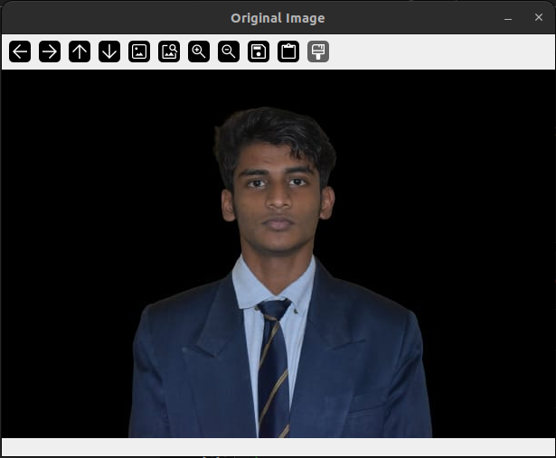
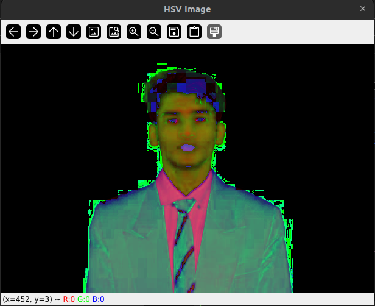
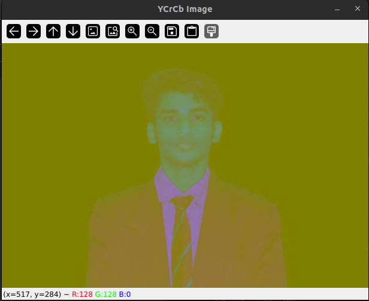
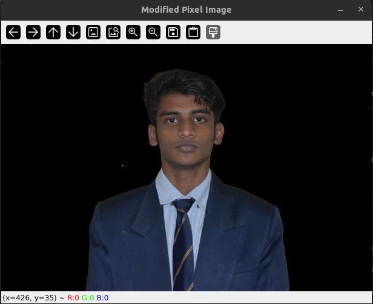
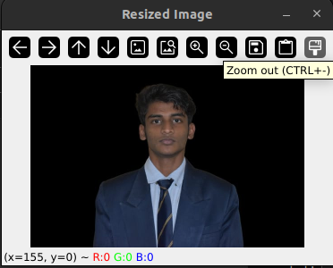
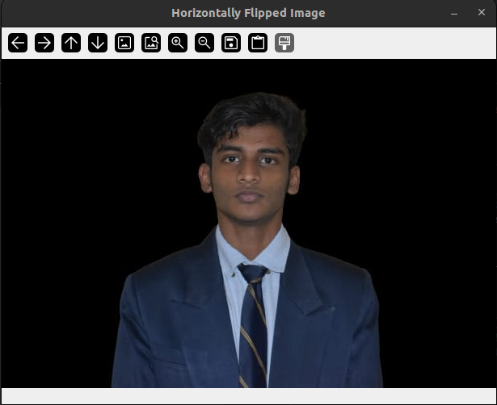

# COLOR_CONVERSIONS_OF-IMAGE
## AIM
Write a Python program using OpenCV that performs the following tasks:

i) Read and Display an Image.

ii) Draw Shapes and Add Text.

iii) Image Color Conversion.

iv) Access and Manipulate Image Pixels.

v) Image Resizing

vi) Image Cropping

vii) Image Flipping

viii) Write and Save the Modified Image


## Software Required:
Anaconda - Python 3.7
## Algorithm:
### Step1:
Load an image from your local directory and display it.
### Step2:
<ul>
<li> Draw a line from the top-left to the bottom-right of the image. </li>
<li>Draw a circle at the center of the image.</li>
<li>Draw a rectangle around a specific region of interest in the image.</li>
<li>Add the text "OpenCV Drawing" at the top-left corner of the image.</li>
</ul>

### Step3:
<ul>
<li>Convert the image from RGB to HSV and display it.</li>
<li>Convert the image from RGB to GRAY and display it.</li>
<li>Convert the image from RGB to YCrCb and display it.</li>
<li>Convert the HSV image back to RGB and display it.</li>
</ul>

### Step4:
<ul>
<li>Access and print the value of the pixel at coordinates (100, 100).</li>
<li>Modify the color of the pixel at (200, 200) to white.</li>
</ul>

### Step5:
Resize the original image to half its size and display it.
### Step6:
Crop a region of interest (ROI) from the image (e.g., a 100x100 pixel area starting at (50, 50)) and display it.
### Step7:
<ul>
<li>Flip the original image horizontally and display it.</li>
<li>Flip the original image vertically and display it.</li>
</ul>

### Step8:
Save the final modified image to your local directory.

## Program:
### Developed By:    Sam Israel D
### Register Number: 212222230128

### i)Read and Display an Image
```python
import cv2

# Load an image from your local directory
image = cv2.imread('/home/sam/Desktop/dipt/COLOR_CONVERSIONS_OF-IMAGE/images/sssam.jpg')

# Display the original image
cv2.imshow('Original Image', image)
cv2.waitKey(0)
cv2.destroyAllWindows()

```
### ii)Draw Shapes and Add Text
```python
# Draw a line from the top-left to the bottom-right of the image
cv2.line(image, (0, 0), (image.shape[1], image.shape[0]), (255, 0, 0), 3)

# Draw a circle at the center of the image
center = (image.shape[1]//2, image.shape[0]//2)
cv2.circle(image, center, 50, (0, 255, 0), 3)

# Draw a rectangle around a specific region of interest (ROI)
cv2.rectangle(image, (100, 100), (200, 200), (0, 0, 255), 3)

# Add text at the top-left corner of the image
cv2.putText(image, 'OpenCV Drawing', (10, 30), cv2.FONT_HERSHEY_SIMPLEX, 1, (255, 255, 255), 2)

# Display the modified image
cv2.imshow('Image with Shapes and Text', image)
cv2.waitKey(0)
cv2.destroyAllWindows()

```
### iii)Image Color Conversion
```python
# Convert and display the image in different color spaces
# RGB to HSV
hsv_image = cv2.cvtColor(image, cv2.COLOR_BGR2HSV)
cv2.imshow('HSV Image', hsv_image)
cv2.waitKey(0)

# RGB to GRAY
gray_image = cv2.cvtColor(image, cv2.COLOR_BGR2GRAY)
cv2.imshow('Gray Image', gray_image)
cv2.waitKey(0)

# RGB to YCrCb
ycrcb_image = cv2.cvtColor(image, cv2.COLOR_BGR2YCrCb)
cv2.imshow('YCrCb Image', ycrcb_image)
cv2.waitKey(0)

# Convert HSV image back to RGB
hsv_to_rgb_image = cv2.cvtColor(hsv_image, cv2.COLOR_HSV2BGR)
cv2.imshow('HSV to RGB Image', hsv_to_rgb_image)
cv2.waitKey(0)
cv2.destroyAllWindows()

```
### iv)Access and Manipulate Image Pixels
```python
# Access and print pixel value at (100, 100)
pixel_value = image[100, 100]
print(f'Pixel value at (100, 100): {pixel_value}')

# Modify the pixel value at (200, 200) to white
image[200, 200] = [255, 255, 255]

# Display the modified image with pixel changes
cv2.imshow('Modified Pixel Image', image)
cv2.waitKey(0)
cv2.destroyAllWindows()

```
### v)Image Resizing
```python
# Resize the original image to half its size
resized_image = cv2.resize(image, (image.shape[1]//2, image.shape[0]//2))

# Display the resized image
cv2.imshow('Resized Image', resized_image)
cv2.waitKey(0)
cv2.destroyAllWindows()

```
### vi)Image Cropping
```python
# Crop a region of interest (ROI)
roi = image[250:350, 250:350]  # Cropping a 100x100 pixel area starting at (250, 250)

# Display the cropped ROI
cv2.imshow('Cropped ROI', roi)
cv2.waitKey(0)
cv2.destroyAllWindows()

```
### vii)Image Flipping
```python
# Flip the image horizontally
horizontally_flipped = cv2.flip(image, 1)
cv2.imshow('Horizontally Flipped Image', horizontally_flipped)
cv2.waitKey(0)

# Flip the image vertically
vertically_flipped = cv2.flip(image, 0)
cv2.imshow('Vertically Flipped Image', vertically_flipped)
cv2.waitKey(0)
cv2.destroyAllWindows()

```
### viii)Write and Save the Modified Image
```python
# Save the final modified image to your local directory
cv2.imwrite('modified_image.jpg', image)
```


## Output:

### i)Read and Display an Image



### ii)Draw Shapes and Add Text


### iii)Image Color Conversion






### iv)Access and Manipulate Image Pixels


### v)Image Resizing


### vi)Image Cropping


### vii)Image Flipping


### viii)Write and Save the Modified Image


## Result:
Thus the images are read, displayed, and written ,and color conversion was performed successfully using the python program.


